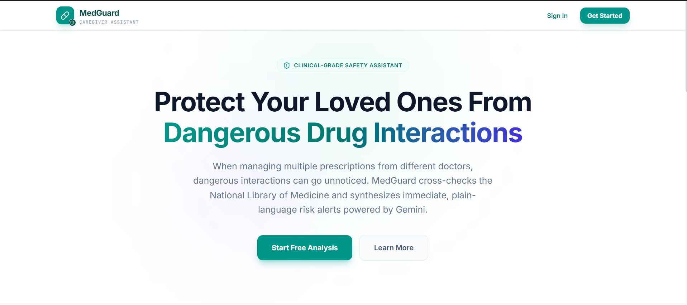
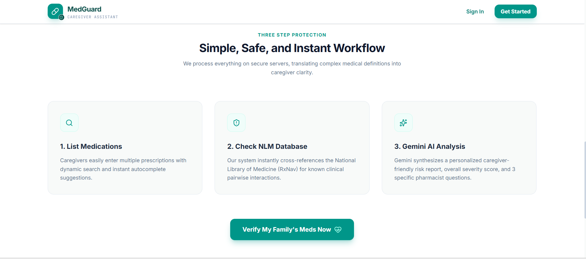

# MedGuard 🛡️💊

**AI-powered medication interaction checker for caregivers**

MedGuard helps caregivers and patients managing multiple prescriptions catch dangerous drug interactions that often go unnoticed when medications come from different doctors who don't share records. Users enter their medication list, and MedGuard cross-references clinical interaction data, then uses Gemini to synthesize a plain-language, prioritized risk analysis — including specific questions to bring to a doctor.

🔗 **Live app:** https://med-guard-ai-delta.vercel.app
🔗 **AI Studio app:** https://ai.studio/apps/83ac10dd-5c29-4cd4-89dd-27a2c8079cea

---

## The Problem

Over 1 million people are sent to the ER every year in the US due to adverse drug interactions — many of them predictable and preventable. This risk is especially high for people managing several prescriptions from different doctors who don't coordinate: a cardiologist prescribes for the heart, a primary care doctor prescribes for everything else, and no one checks the full combined list. Family caregivers are often the last line of defense, with no tools to catch what the system misses.

## What MedGuard Does

1. User signs in and adds their current medications via a searchable interface (RxNorm-backed autocomplete)
2. MedGuard checks every pairwise combination against the National Library of Medicine's RxNav interaction database
3. The full medication list and raw interaction data are sent to **Gemini**, which:
   - Synthesizes a prioritized risk summary across the *entire* regimen — not just individual pairs, but cumulative risk (e.g., three drugs that each raise the same risk factor independently)
   - Assigns an overall severity rating with plain-language reasoning
   - Generates specific, actionable questions to ask a doctor or pharmacist
4. Results are displayed in a clear, color-coded dashboard, and saved to the user's history

---

## Screenshots

### Landing Page
 
 

### Sign In / Sign Up
  

### Medication Regimen Checker (Dashboard)
  

### Gemini AI Safety Synthesis Panel
  

### Pairwise Interaction Details
 

### Past Analyses / History
 -->

---

## Why Gemini (Not Just a Database Lookup)

RxNav gives raw pairwise interaction data, but it can't reason across a whole medication list the way a clinician would. Gemini is the core intelligence layer of this app — it takes the raw interaction data and the full drug list, and produces the kind of holistic, cumulative-risk reasoning and caregiver-facing communication that a static API cannot. This is not a chatbot bolted onto the UI; it's the central logic that turns raw clinical data into something a caregiver can actually act on.

## Tech Stack

- **Frontend:** React, Tailwind CSS
- **Auth & Data:** Firebase Authentication, Firestore
- **AI:** Gemini API via Google AI Studio
- **Drug Data:** RxNorm / RxNav REST APIs (National Library of Medicine, NIH)
- **Hosting:** Vercel (serverless functions for API routes)
- **Built with:** Google AI Studio Build Mode

## Setup / Run Locally

**Prerequisites:** Node.js

1. Install dependencies:
   `npm install`
2. Add your environment variables in a `.env` file (see `.env.example`)
3. Run the app:
    `npm run app`

## Disclaimer

MedGuard is a hackathon prototype and not a substitute for professional medical advice. All results should be confirmed with a licensed pharmacist or physician before making any medication changes. No real patient data is used or stored.

---

Built for [BuildWith Ai-Hackathon] — Web Development Track
